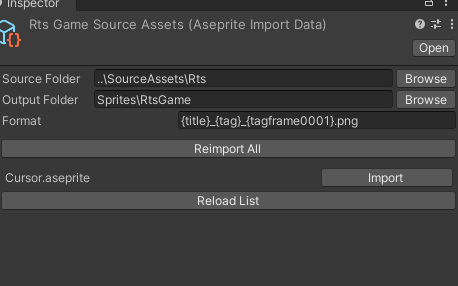
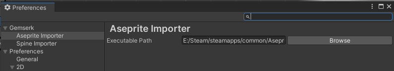

The idea of this project is to become a hub of useful dependencies for making games.

List of packages: 

* Triggers
    - Triggers logic like SC2.
    - UPM url: https://github.com/acoppes/unity-gemserk-utilities.git?path=/Packages/com.gemserk.triggers
* Aseprite Utilities
    - Aseprite assets importer, [more info](Packages/com.gemserk.aseprite/Readme.md).
    - UPM url: https://github.com/acoppes/unity-gemserk-utilities.git?path=/Packages/com.gemserk.aseprite
* Gameplay Utilities
    - General utilities
    - UPM url: https://github.com/acoppes/unity-gemserk-utilities.git?path=/Packages/com.gemserk.utilities
* Leopotam ECS Extensions
    - UPM url: https://github.com/acoppes/unity-gemserk-utilities.git?path=/Packages/com.gemserk.leopotamecs
* Triggers Extensions
    - Triggers and more, built over all the other projects.
    - UPM url: https://github.com/acoppes/unity-gemserk-utilities.git?path=/Packages/com.gemserk.triggers.extensions
* Simple Build Tools
    - UPM url: https://github.com/acoppes/unity-gemserk-utilities.git?path=/Packages/com.gemserk.buildtools
* Spine Utilities
    - Spine importer.
    - UPM url: https://github.com/acoppes/unity-gemserk-utilities.git?path=/Packages/com.gemserk.spine

# Aseprite Utilities

It is basically a helper to run Aseprite executable to export png files from within Unity using command line arguments. This a different approach to the Aseprite importer from Untiy which process the source file .ase to generate sprites and animations, if you prefer that approach use [that package](https://docs.unity3d.com/Packages/com.unity.2d.aseprite@1.0/manual/index.html). The main reason was that if Aseprite creates a new feature, I will automatically have it by using the executable, however, using the .ase importer allows you to get lots of more information from the source file, so both approaches have pros and cons.

## Aseprite Import Data

Configure a source folder where multiple .aseprite files are, an output folder inside Unity assets and a format to use following the asprite valid export format, for example `{title}_{tag}_{tagframe0001}.png`, and it will run Aseprite.exe to export a list of png following that format.

Configure Aseprite.exe path in Preferences in order to be able to execute importer.