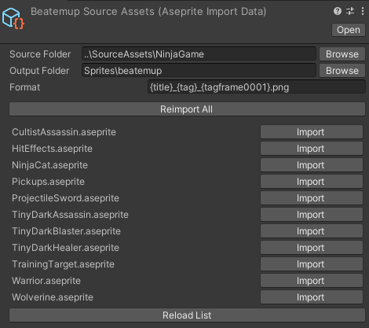

The idea of this project is to become a hub of useful dependencies for making games.

## General Utilities

* Gemserk Unity Utilities
    - General utilities like extension methods for Vector2, etc.
    - UPM url: https://github.com/acoppes/unity-gemserk-utilities.git?path=/Packages/com.gemserk.utilities

* Unity Triggers
    - Basic core for Triggers logic inspired in Starcraft 2 Editor, to use with Unity.
    - UPM url: https://github.com/acoppes/unity-gemserk-utilities.git?path=/Packages/com.gemserk.triggers

## ECS 

* Leopotam ECS Extensions
    - Custom architecture over Leopotam ECS and Unity. 
    - UPM url: https://github.com/acoppes/unity-gemserk-utilities.git?path=/Packages/com.gemserk.leopotamecs

* Triggers ECS Extensions
    - Triggers and more, built over Unity Triggers and Leopotam ECS Extensions.
    - UPM url: https://github.com/acoppes/unity-gemserk-utilities.git?path=/Packages/com.gemserk.triggers.extensions

* Games Core
    - Triggers, Components, Systems and more stuff used in my games, [more info at my itch page](https://arielsan.itch.io/).
    - UPM url: https://github.com/acoppes/unity-gemserk-utilities.git?path=/Packages/com.gemserk.gamescore

## Other tools

* Aseprite Utilities
    - Aseprite assets importer, [more info](#aseprite-utilities).
    - There is an example in AnimationsExample folder in root project.
    - UPM url: https://github.com/acoppes/unity-gemserk-utilities.git?path=/Packages/com.gemserk.aseprite

* Simple Build Tools
    - Some build script code to call from command line to build different games from same project (was mainly used for my minigames project).
    - UPM url: https://github.com/acoppes/unity-gemserk-utilities.git?path=/Packages/com.gemserk.buildtools

* Spine Unity Importer
    - Execute Spine command tools and autoimport in Unity (needs Spine installed)
    - UPM url: https://github.com/acoppes/unity-gemserk-utilities.git?path=/Packages/com.gemserk.spine

# Aseprite Utilities

It is basically a helper to run Aseprite executable to export png files from within Unity using command line arguments. This a different approach to the Aseprite importer from Untiy which process the source file .ase to generate sprites and animations, if you prefer that approach use [that package](https://docs.unity3d.com/Packages/com.unity.2d.aseprite@1.0/manual/index.html). The main reason was that if Aseprite creates a new feature, I will automatically have it by using the executable, however, using the .ase importer allows you to get lots of more information from the source file, so both approaches have pros and cons.

## Aseprite Import Data

Configure a source folder where multiple .aseprite files are, an output folder inside Unity assets and a format to use following the asprite valid export format, for example `{title}_{tag}_{tagframe0001}.png`, and it will run Aseprite.exe to export a list of png following that format.

Configure Aseprite.exe path in Preferences in order to be able to execute importer.